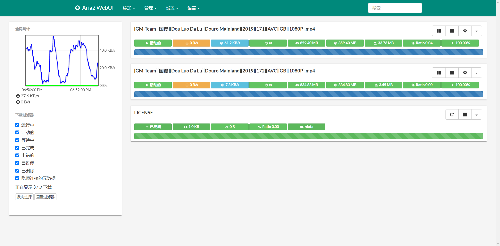

# webui2-aria2

fork from [webui-aria2](https://github.com/ziahamza/webui-aria2)，更改内容：增加代理、给 /data 目录赋予权限。

aira2 是一款使用 C++ 编写的轻量级跨平台命令行下载工具，支持 HTTP/HTTPS, FTP, SFTP, BitTorrent 和 Metalink 等多种协议，可用它来优雅的下载学习资料（：

## 构建镜像
## 运行容器
## 使用
网页访问 http://localhost:9100 即可。
